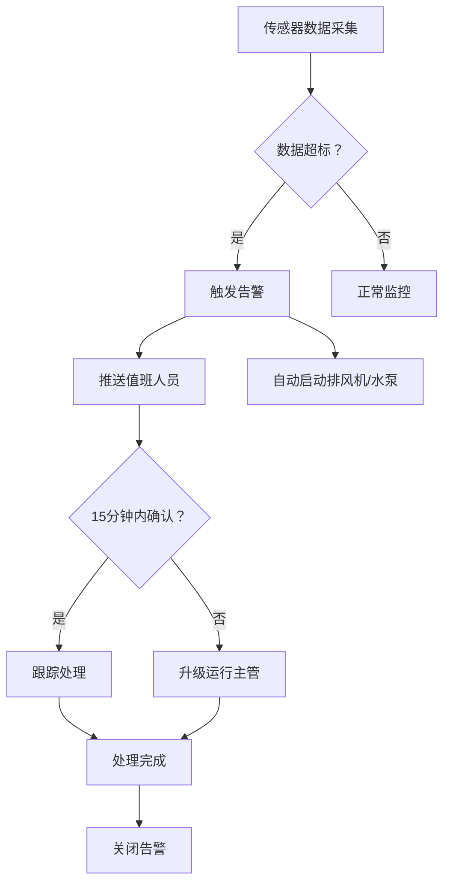

## 1. 产品概述

智慧城市地下综合管廊运维与安全管理平台是一套集成环境监测、设备控制、隐患管理、施工审批、维保调度于一体的综合管理系统。通过实时接入传感器数据，实现智能告警、自动联动控制、全流程工单闭环，保障地下管廊安全运行，提升运维效率。

- 解决问题：传统人工巡检效率低、隐患发现不及时、施工管理混乱、设备维保缺乏系统性
- 目标用户：管廊公司管理员、运行主管、值班人员、巡检员、维修班组、各管线单位（电力/通信/燃气/给排水）
- 产品价值：实现管廊运维数字化、智能化，降低安全事故风险，提升管理效率200%以上

## 2. 核心功能

### 2.1 用户角色

| 角色 | 注册方式 | 核心权限 |
|------|----------|----------|
| 管廊公司管理员 | 系统创建 | 全局数据查看、系统配置、用户管理、报表导出 |
| 运行主管 | 系统创建 | 告警升级处理、隐患审批、工单审核、数据统计 |
| 值班人员 | 系统创建 | 实时监控、告警确认、设备远程控制 |
| 巡检员 | 系统创建 | 扫码打卡、隐患上报、整改执行 |
| 维修班组 | 系统创建 | 维保工单接收、维修执行、照片上传 |
| 管线单位用户 | 系统创建 | 仅查看本管线数据、入廊施工申请、相关审批记录查看 |

### 2.2 功能模块

1. **实时监控仪表板**：舱段环境监测、设备状态展示、告警实时弹窗、关键指标统计
2. **告警管理模块**：告警列表、升级机制、设备联动控制、告警历史追溯
3. **巡检管理模块**：巡检路线配置、扫码打卡、隐患上报、整改工单、超期管控
4. **施工管理模块**：入廊申请、风险评估、电子通行证、施工区域锁定、超时催办
5. **设备维保模块**：维保计划、周期工单自动生成、工单分配、维修闭环
6. **数据统计与报表模块**：多维度筛选、可视化图表、月度运维报表、工单明细导出
7. **权限管理模块**：角色权限配置、管线数据隔离、操作日志审计

### 2.3 页面详情

| 页面名称 | 模块名称 | 功能描述 |
|----------|----------|----------|
| 登录页 | 身份认证 | 账号密码登录、角色自动识别、权限跳转 |
| 监控大屏 | 实时监控 | 舱段总览地图、环境参数实时曲线、告警弹窗、设备状态面板 |
| 告警列表页 | 告警管理 | 告警筛选、确认处理、升级记录、联动控制按钮、历史查询 |
| 巡检管理页 | 巡检管理 | 路线配置、打卡记录、隐患列表、整改工单、超期告警 |
| 隐患上报页 | 巡检管理 | 隐患等级选择、位置标注、照片上传、自动生成整改工单 |
| 施工申请页 | 施工管理 | 方案上传、安全承诺书、风险评估、作业时段建议 |
| 施工审批页 | 施工管理 | 申请审核、区域锁定、电子通行证生成、超时催办 |
| 维保计划页 | 设备维保 | 周期配置、工单自动生成、班组分配、进度跟踪 |
| 工单执行页 | 设备维保 | 工单详情、修复照片上传、闭环确认、超时升级 |
| 统计分析页 | 数据统计 | 环境达标率、设备完好率、隐患整改进度、施工占用量、多维度筛选 |
| 报表导出页 | 数据统计 | 月度运维分析报表、工单执行明细、一键导出Excel |
| 用户管理页 | 权限管理 | 用户列表、角色配置、管线单位关联、操作日志 |
| 系统配置页 | 权限管理 | 告警阈值配置、联动规则配置、通知模板配置 |

## 3. 核心流程

### 3.1 告警处理流程
传感器数据超标 → 系统自动告警 → 推送至值班人员 → 启动排风机/水泵联动 → 值班人员15分钟内确认 → 确认后跟踪处理 → 超时未确认自动升级运行主管 → 处理完成关闭告警

### 3.2 巡检隐患处理流程
巡检员扫码打卡 → 发现隐患 → 拍照上传、选择等级 → 系统自动生成整改工单 → 设置整改限期 → 分配责任人 → 整改完成上传凭证 → 审核闭环 → 超期未完成自动暂停该区域施工

### 3.3 入廊施工流程
外部单位提交申请 → 上传施工方案+安全承诺书 → 系统根据管线分布评估风险等级 → 建议施工时段 → 管廊公司审核 → 审核通过锁定作业区域 → 生成电子通行证 → 施工完成销项 → 超时未完工自动催办

### 3.4 设备维保流程
维保计划按周期配置 → 系统自动生成工单 → 分配维修班组 → 班组接收执行 → 维修完成上传前后对比照 → 审核闭环 → 超48小时未闭环自动升级设备部长

## 4. 用户界面设计

### 4.1 设计风格
- **主色调**：深蓝色 #0F172A 作为主背景，代表科技感与专业性；天蓝色 #0EA5E9 作为主强调色，代表安全与监控；橙色 #F97316 作为告警色，代表警告；绿色 #10B981 作为正常状态色
- **次色调**：深灰 #1E293B、中灰 #334155、浅灰 #94A3B8，用于界面分层
- **按钮风格**：扁平化设计，圆角8px，悬浮微动画效果，主按钮带渐变
- **字体**：标题使用 "JetBrains Mono" 等宽字体增强科技感，正文使用 "PingFang SC" 确保中文可读性
- **布局风格**：左侧导航栏+顶部状态栏+主内容区的经典后台布局，卡片式模块设计，数据大屏采用深色科技感布局
- **图标风格**：线性图标，统一24px尺寸，使用Tabler Icons库

### 4.2 页面设计概述

| 页面名称 | 模块名称 | UI元素 |
|----------|----------|--------|
| 监控大屏 | 实时监控 | 深色背景、舱段3D示意图、实时数据仪表盘、告警走马灯、环境曲线图、设备状态网格 |
| 告警列表页 | 告警管理 | 严重/警告/提示三级颜色标识、告警倒计时、一键联动控制、处理时间线 |
| 统计分析页 | 数据统计 | 多维度筛选器、饼图/柱状图/折线图组合、数据卡片网格、导出按钮悬浮效果 |
| 工单详情页 | 各模块工单 | 步骤式时间线、照片对比滑块、状态流转标签、操作按钮组 |

### 4.3 响应式
- 采用桌面端优先设计，主适配1920x1080及以上分辨率
- 监控大屏单独适配大屏显示（2560x1440）
- 移动端简化为核心功能：告警查看、隐患上报、工单处理
- 所有表格支持横向滚动，图表自适应容器宽度

### 4.4 动效设计
- 页面加载采用渐入+上移动画，各模块按顺序延迟出现
- 告警弹框采用抖动+脉冲动画，强调紧急性
- 数据更新时数字滚动动画，曲线数据点脉动效果
- 状态流转采用平滑过渡，按钮点击波纹反馈
- 导航菜单展开/收起采用弹性动画
