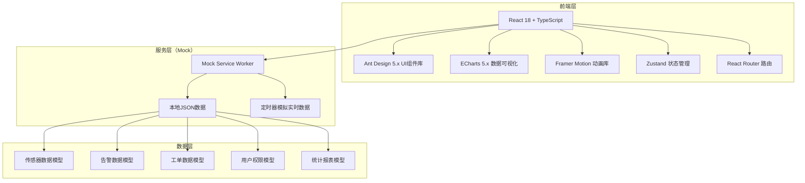
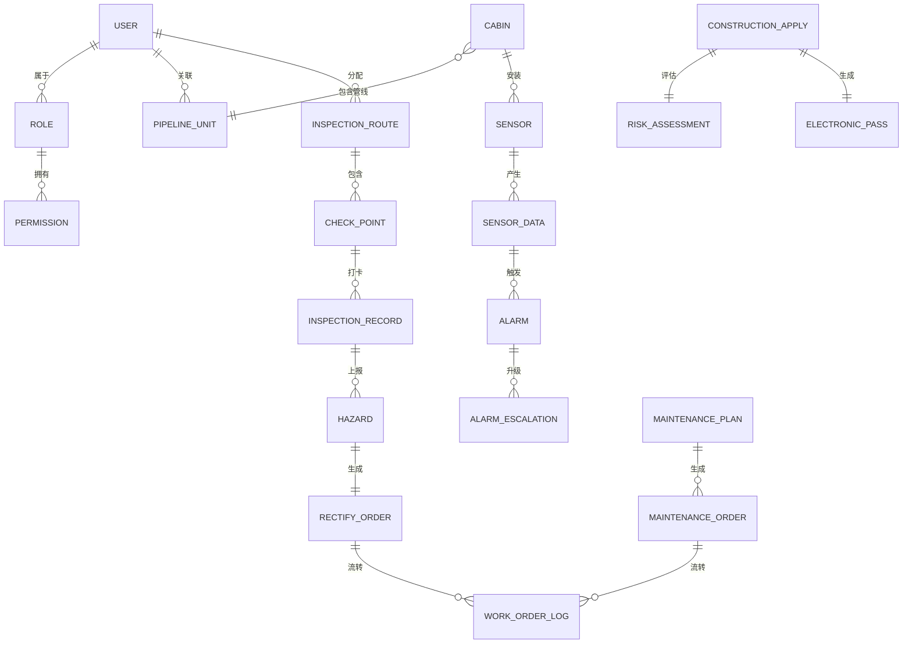

## 1. 架构设计



## 2. 技术描述

- **前端框架**: React@18.2.0 + TypeScript@5.4.0
- **构建工具**: Vite@5.2.0
- **UI组件库**: Ant Design@5.16.0
- **图表库**: ECharts@5.5.0
- **状态管理**: Zustand@4.5.0
- **路由管理**: React Router DOM@6.22.0
- **动画库**: Framer Motion@11.0.0
- **图标库**: @tabler/icons-react@3.1.0
- **样式方案**: Tailwind CSS@3.4.0 + CSS Variables
- **Mock方案**: Mock Service Worker@2.2.0 + 本地JSON
- **Excel导出**: xlsx@0.18.5
- **日期处理**: dayjs@1.11.10
- **代码规范**: ESLint@8.57.0 + Prettier@3.2.0

## 3. 目录结构

```
src/
├── assets/              # 静态资源
│   ├── images/
│   └── styles/          # 全局样式、主题变量
├── components/          # 公共组件
│   ├── layout/          # 布局组件
│   ├── charts/          # 图表组件
│   ├── common/          # 通用组件
│   └── business/        # 业务组件
├── pages/               # 页面组件
│   ├── dashboard/       # 监控大屏
│   ├── alarm/           # 告警管理
│   ├── inspection/      # 巡检管理
│   ├── construction/    # 施工管理
│   ├── maintenance/     # 设备维保
│   ├── statistics/      # 统计分析
│   ├── system/          # 系统管理
│   └── login/           # 登录页
├── store/               # 状态管理
│   ├── useUserStore.ts
│   ├── useAlarmStore.ts
│   └── useGlobalStore.ts
├── router/              # 路由配置
│   ├── index.tsx
│   └── routes.ts
├── services/            # API服务
│   ├── api.ts
│   ├── mock/            # Mock数据
│   └── types.ts         # 类型定义
├── hooks/               # 自定义Hooks
│   ├── useRealtime.ts
│   ├── usePermission.ts
│   └── useExport.ts
├── utils/               # 工具函数
│   ├── format.ts
│   ├── validate.ts
│   └── export.ts
├── types/               # 全局类型定义
│   ├── index.d.ts
│   └── models.ts
├── App.tsx
└── main.tsx
```

## 4. 路由定义

| 路由路径 | 页面名称 | 权限角色 | 说明 |
|----------|----------|----------|------|
| /login | 登录页 | 所有 | 身份认证入口 |
| /dashboard | 监控大屏 | 管理员、运行主管、值班人员 | 实时数据总览 |
| /alarm/list | 告警列表 | 管理员、运行主管、值班人员 | 告警处理页面 |
| /alarm/history | 告警历史 | 管理员、运行主管 | 历史告警查询 |
| /inspection/route | 巡检路线 | 管理员、运行主管 | 路线配置管理 |
| /inspection/record | 打卡记录 | 管理员、运行主管、巡检员 | 巡检打卡查询 |
| /inspection/hazard | 隐患管理 | 所有授权角色 | 隐患上报与整改 |
| /construction/apply | 施工申请 | 管线单位、管理员 | 入廊申请提交 |
| /construction/approve | 施工审批 | 管理员、运行主管 | 申请审核与通行证 |
| /construction/list | 施工列表 | 所有授权角色 | 施工记录查询 |
| /maintenance/plan | 维保计划 | 管理员、设备部长 | 维保周期配置 |
| /maintenance/order | 维保工单 | 管理员、维修班组 | 工单执行与闭环 |
| /statistics/overview | 统计总览 | 管理员、运行主管 | 多维度数据统计 |
| /statistics/report | 报表导出 | 管理员 | 月度报表与明细导出 |
| /system/user | 用户管理 | 管理员 | 用户与角色管理 |
| /system/config | 系统配置 | 管理员 | 阈值与规则配置 |

## 5. 数据模型

### 5.1 实体关系图



### 5.2 核心数据结构

#### 5.2.1 传感器数据
```typescript
interface SensorData {
  id: string;
  sensorId: string;
  cabinId: string;
  sensorType: 'temperature' | 'humidity' | 'methane' | 'hydrogenSulfide' | 'liquidLevel' | 'waterImmersion';
  value: number;
  unit: string;
  threshold: {
    warning: number;
    danger: number;
  };
  status: 'normal' | 'warning' | 'danger';
  timestamp: string;
}
```

#### 5.2.2 告警数据
```typescript
interface Alarm {
  id: string;
  sensorId: string;
  cabinId: string;
  alarmType: 'environment' | 'device' | 'construction' | 'hazard';
  level: 'critical' | 'warning' | 'notice';
  title: string;
  description: string;
  sensorValue?: number;
  threshold?: number;
  status: 'pending' | 'acknowledged' | 'processing' | 'resolved' | 'closed';
  acknowledgedAt?: string;
  acknowledgedBy?: string;
  escalated: boolean;
  escalatedAt?: string;
  escalatedTo?: string;
  linkedDeviceAction?: {
    deviceId: string;
    deviceName: string;
    action: 'start' | 'stop';
    executedAt: string;
  };
  createdAt: string;
  resolvedAt?: string;
}
```

#### 5.2.3 工单数据
```typescript
interface WorkOrder {
  id: string;
  orderNo: string;
  type: 'rectify' | 'maintenance' | 'construction';
  title: string;
  description: string;
  level: 'high' | 'medium' | 'low';
  status: 'pending' | 'processing' | 'reviewing' | 'completed' | 'overdue' | 'escalated';
  cabinId: string;
  area?: string;
  assigneeId: string;
  assigneeName: string;
  deadline: string;
  images?: {
    before?: string[];
    after?: string[];
  };
  createdAt: string;
  createdBy: string;
  completedAt?: string;
  logs: WorkOrderLog[];
}
```

#### 5.2.4 用户与权限
```typescript
interface User {
  id: string;
  username: string;
  name: string;
  role: RoleType;
  pipelineUnitId?: string;
  pipelineUnitName?: string;
  permissions: string[];
  status: 'active' | 'inactive';
}

type RoleType = 'admin' | 'supervisor' | 'operator' | 'inspector' | 'maintenance' | 'pipelineUser';
```

#### 5.2.5 施工申请
```typescript
interface ConstructionApply {
  id: string;
  applyNo: string;
  applicantUnit: string;
  applicantName: string;
  projectName: string;
  constructionType: string;
  cabinId: string;
  constructionArea: string;
  planStartTime: string;
  planEndTime: string;
  actualStartTime?: string;
  actualEndTime?: string;
  constructionScheme?: string;
  safetyCommitment?: string;
  riskAssessment: {
    level: 'high' | 'medium' | 'low';
    score: number;
    affectedPipelines: string[];
    suggestedTimePeriod: string;
    riskPoints: string[];
  };
  status: 'draft' | 'pending' | 'approved' | 'rejected' | 'inProgress' | 'completed' | 'overdue';
  electronicPass?: {
    passNo: string;
    qrCode: string;
    validFrom: string;
    validTo: string;
    lockedArea: string;
  };
  approvedBy?: string;
  approvedAt?: string;
  createdAt: string;
}
```

## 6. 前端核心技术方案

### 6.1 实时数据模拟
- 使用 `setInterval` 每3秒更新一次传感器数据
- 数据波动模拟：在基准值上叠加随机波动
- 告警触发逻辑：当模拟数据超过阈值时自动生成告警
- 使用 Zustand store 管理实时数据状态

### 6.2 权限控制
- 路由级权限：通过路由守卫拦截未授权访问
- 组件级权限：自定义 `usePermission` Hook 控制按钮/组件显示
- 数据级权限：根据用户角色过滤API返回数据
- 管线单位数据隔离：查询时自动添加 `pipelineUnitId` 过滤条件

### 6.3 状态管理分层
```
Global Store
├── userStore       # 用户信息、权限
├── alarmStore      # 实时告警、未处理告警
├── sensorStore     # 实时传感器数据
└── uiStore         # 主题、侧边栏状态
```

### 6.4 图表组件封装
- 封装通用图表组件，支持ECharts所有配置
- 实时数据更新时使用 `setOption` 增量更新
- 支持图表自适应、主题切换、导出图片

### 6.5 导出功能
- 使用 `xlsx` 库生成Excel文件
- 支持多Sheet导出（月度报表、工单明细）
- 支持筛选条件导出当前数据
